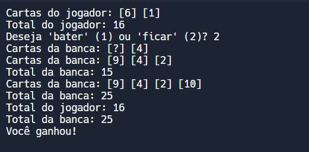

# JOGO DO 21 EM C PLUS PLUS
👨‍💻ESSE É PEQUENO JOGO QUE RODA NO CONSOLE DA IDE.

 <br>

## DESCRIÇÃO:
O Blackjack é um jogo de cartas popular em cassinos e pode ser jogado entre um jogador e a banca (ou dealer). O objetivo principal do jogo é obter um total de cartas o mais próximo possível de 21, sem ultrapassar esse valor. O jogador compete diretamente contra a banca, e o vencedor é aquele que obtiver um total mais próximo de 21 sem exceder esse número.

## REGRAS BÁSICAS:
1. **Valor das Cartas:**
   - **Cartas de 2 a 10:** Valem o valor numérico correspondente.
   - **Cartas J (Valete), Q (Dama) e K (Rei):** Valem 10 pontos cada.
   - **Ás:** Pode valer 1 ou 11 pontos, dependendo do que for mais vantajoso para o jogador.

2. **Distribuição das Cartas:**
   - Cada jogador e a banca recebem duas cartas no início.
   - Uma das cartas da banca é mostrada virada para cima (visível para o jogador), enquanto a outra permanece virada para baixo (oculta).

3. **Turno do Jogador:**
   - O jogador pode optar por "bater" (pedir uma carta adicional) ou "ficar" (manter suas cartas atuais).
   - O jogador pode continuar batendo até decidir ficar ou ultrapassar 21 (o que resulta em uma perda imediata).

4. **Turno da Banca:**
   - Após o jogador decidir ficar, a banca revela sua carta oculta e deve seguir regras específicas para jogar.
   - A banca deve bater até alcançar um total de pelo menos 17. A banca deve ficar se atingir 17 ou mais (alguns cassinos usam regras diferentes, como a banca batendo em um "suave 17").

5. **Resultado do Jogo:**
   - Se o total de cartas do jogador ultrapassar 21, o jogador perde.
   - Se a banca ultrapassar 21, o jogador ganha.
   - Caso o jogador tenha um total mais próximo de 21 do que a banca, o jogador ganha.
   - Caso a banca tenha um total mais próximo de 21, a banca ganha.
   - Se ambos tiverem o mesmo total, é um empate.

## EXECUTANDO O JOGO:
### COMO EXECUTAR O CÓDIGO?
1. **Compilar o Código:**
   - Abra um terminal ou prompt de comando e navegue até o diretório onde o arquivo está salvo.
   - Compile o código com o comando:

     ```bash
     g++ -o CODIGO CODIGO.cpp
     ```

2. **Executar o Programa:**
   - Execute o programa com o comando:

     ```bash
     ./CODIGO
     ```

### COMO JOGAR?
1. **Começo do Jogo:**
   - O jogador e a banca recebem duas cartas cada.
   - O jogador vê suas cartas e a carta visível da banca.

2. **Decisões do Jogador:**
   - O jogador avalia suas cartas e a carta visível da banca.
   - O jogador decide entre:
     - **Bater (Pedir Carta):** Solicita uma carta adicional do baralho.
     - **Ficar (Manter as Cartas Atuais):** Mantém o total atual e passa a vez para a banca.

3. **Turno da Banca:**
   - A banca revela sua carta oculta e joga seguindo as regras específicas (geralmente, bate até ter pelo menos 17).

4. **Determinação do Vencedor:**
   - Compara-se o total das cartas do jogador e da banca para determinar o vencedor com base nas regras descritas.

#### ESTRATEGIAS:
- **Se o total das suas cartas é 11 ou menos, sempre bata, pois é seguro.**
- **Se o total das suas cartas está entre 12 e 16, considere a carta visível da banca.**
  - **Se a banca tem uma carta baixa (2 a 6), você pode optar por ficar.**
  - **Se a banca tem uma carta alta (7 a 10, ou Ás), você pode optar por bater.**
- **Se o total das suas cartas é 17 ou mais, geralmente é melhor ficar.**

## NÃO SABE?
- Entendemos que para manipular arquivos em muitas linguagens e tecnologias, é necessário possuir conhecimento nessas áreas. Para auxiliar nesse aprendizado, oferecemos cursos gratuitos disponíveis:
* [CURSO DE C++](https://github.com/VILHALVA/CURSO-DE-C-PLUS-PLUS)
* [CONFIRA MAIS CURSOS](https://github.com/VILHALVA?tab=repositories&q=+topic:CURSO)

## CREDITOS:
- [PROJETO CRIADO PELO VILHALVA](https://github.com/VILHALVA)
